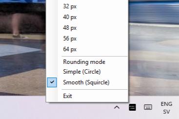

# Windows-RoundedScreen

**THIS PROJECT IS NOT MAINTAINED BUT I FREQUENTLY CHECK THE PULL REQUESTS**

A simple workaround to get rounded screen corners on Windows.

> 🖥️ [Download RoundedScreen.exe](https://github.com/BeezBeez/Windows-RoundedScreen/releases/latest/download/RoundedScreen.exe)

## Customize rounded corners

The program runs in the Windows taskbar.

Right-clicking the program provides options for customizing the rounded corners style and radius:



Your selections are automatically saved, and will be the same when you reopen the program.

## Troubleshooting

**Program doesn't appear in taskbar on Windows 11**

If you are using Windows 11, you will need to add the program to your taskbar:

1. Run the program
2. Right-click your taskbar and select "Taskbar settings"
3. In the Settings select "Other system tray icons"
4. Enable the system tray icon for "RoundedScreen"

# Changelog

## Latest changes

- hidden from alt+tab list
- made corners a bit smaller
- added an AppIcon
- upped the version number
- added a command to quit the program
- added program to taskbar with corner size options
- added superellipse rounding style for smoother corners
- customization of corner style and size is now saved between sessions

# How to build this project

## Prerequisites

- **Visual Studio 2022 Build Tools** with the Managed Desktop workload
- **.NET Framework 4.7.2 Targeting Pack** (installed as a component of Build Tools)

## Install

Install prerequisites:

```bat
install.bat
```

## Build

Build the program:

```bat
build.bat
```

Program is built to `RoundedScreen/bin/Release/RoundedScreen.exe`.

## Run

Run the program after building:

```bat
run.bat
```
